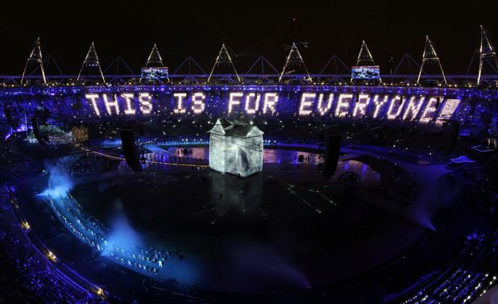
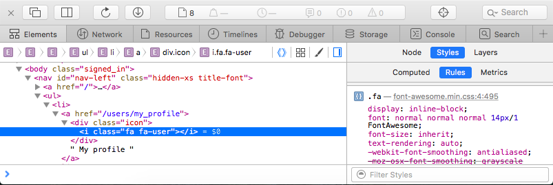

# HTML/CSS
</h1>

    
Open web technologies (such as HTML and CSS) have three most peculiar particularities compared to other technologies:  

<ul>
<li>Because anyone is meant to be allowed to code an interpreter for those languages (that what browsers are!), people making decisions on those technologies are part of an open consortium of companies (called the W3C), which operates on consensus; therefore they evolve rather slowly. </li>
<li>Reverse compatibility is among the most important values kept in mind when deciding on evolutions, because newest browsers should keep being able to run older websites, and older browsers should be able to access newest websites. </li>
<li>They were not initially designed to make applications or well-designed pages, but just display research documents; while they have come a long way since then, it is visible in the ways things are done. 
For each of those three reasons, it is quite important, in order to understand what those technologies are made of today, to understand where they come from, and the legacy that comes with them.</li>
</ul>

<h2>At first, there was HTML</h2>

<h3>A bit of history</h3>

HTML and HTTP, the earliest bricks of the web (which he initially called World Wide Web), were invented by sir Tim Berners-Lee when he was working for the CERN in France/Switzerland. (Since the lab is on the border, which country the web was actually invented in is still to this day a controversial topic; also, he is an English citizen, so here is more controversy!)  

At that point, the internet was already open to the public, but lacked a common software platform, and this was Berners-Lee&rsquo;s attempt to bring one to the world.

<h3>The difference between the internet and the web?</h3>

The web is anything that happens in your browser. When you&rsquo;re using Skype, you&rsquo;re using the internet and not the web.  

What were people using the internet for before the web: for instance, emails (but not in a browser like Gmail, only with a mail client like Outlook/Thunderbird/Apple&rsquo;s Mail today), newsgroups (something that still exists but is not mainstream to this day, and feels a bit like today&rsquo;s forums), &hellip;   

The problem was: all of those (Skype, emails, &hellip;) use their own way to structure the data they send. It would make it very disorganized to make something available somewhere on the internet, like the research papers of Berners-Lees colleagues at the CERN.  

So, he came up with two things:  

<ul>
<li>HTTP, a protocol defining how servers and clients can organize their communications together. It is so synonymous to the web, that what we call software web servers today (Apache, nginx, &hellip;) are technically HTTP servers, i.e. servers designed to receive HTTP requests and send back appropriate responses following the protocol. </li>
<li>HTML, a markup language to help structure the research papers: what is a title, what is a paragraph, etc. 
On Christmas in 1990, he put the first web server online, and published the very first web client in a newsgroup, so that people could go see his website. The web was born. </li>
</ul>

At this point, the need for such a technological stack to make material available online was so obvious, that Berners-Lee was by far not the only one to come up with such an idea. The main difference was that unlike the other proposals, Berners-Lee&rsquo;s World Wide Web was free and available for all to use. As he famously said: &ldquo;This is for everyone&rdquo;.  

 
<em>Tim Berners-Lee was invited to appear on stage during the gigantic opening event for the London Olympics. He was simply sitting at a NeXT computer, just like the one he used to host his first web server, in front of his famous quote.</em>  

Industry vendors started to want to use his protocol, so instead of keeping a tight grip on it, he created the World Wide Web Consortium (W3C) in 1994, which company pay a membership to in order to be able to help making the decisions to push those technologies forward. Berners-Lee is still the head of the W3C to this day.  

<h2>In a nutshell</h2>

<h3>HTML in a nutshell</h3>

HTML is a markup language, which you are expected to be acquainted with from your level 2 project. If you feel like you need a mind-refresher, feel free to check out some tutorials, such as this one: <a href="https://learn.shayhowe.com/html-css/" title="http://learn.shayhowe.com/html-css/" target="_blank">http://learn.shayhowe.com/html-css/</a>  

The breadth of HTML is actually not very large, as it is not meant to include advanced features; getting acquainted on each relevant tag and attribute doesn&rsquo;t take much time, because there aren&rsquo;t that many. The part of HTML that is trickiest to go over is probably forms, because there are quite a few possible components (text fields, checkboxes, text areas, &hellip; even sliders and color pickers in the most recent HTML specifications!)  

The promise of HTML is that you should keep your document as properly structured and semantic as you can; and if you do, it should remain easily accessible to the browsers that will exist in 20 years, while also making it easier to keep your code accessible, performant, and optimized for search engines through time. See: <a href="/rltoken/afy6DLTmHklXhKpOFeXcwA" title="http://vanseodesign.com/web-design/semantic-html/" target="_blank">http://vanseodesign.com/web-design/semantic-html/</a>  

<h3>CSS in a nutshell</h3>

CSS (Cascading Style Sheets) were invented by Bert Bos and Håkon Wium Lie, because HTML was getting less and less semantic, and more and more about presentation, which would make it less future-proof and more verbose.  

For instance, you could write that: 
<code>
&lt;center&gt;&lt;p&gt;&lt;font color=&quot;red&quot;&gt;Hello to &lt;b&gt;all&lt;/b&gt; of my visitors!&lt;/font&gt;&lt;/p&gt;&lt;/center&gt;  
</code> 
The fact that a text should be centered, have a certain color, and be represented in bold is part of presentation, and shouldn&rsquo;t be in the HTML. The fact that it&rsquo;s a paragraph, however, is part of the structure, and therefore is semantic information. 
Also, if you needed to make a whole page red, you needed to write <code>&lt;font color=&quot;red&quot;&gt;</code> at every single line.  

CSS enforces not only semantics in the HTML, but also mutualization of the presentation layer, and therefore less code.  

Now, <code>&lt;center&gt;</code>, <code>&lt;font&gt;</code> and <code>&lt;b&gt;</code> are banned in HTML, and we got some more semantic tags, like <code>&lt;strong&gt;</code>, <code>&lt;em&gt;</code>, and more recently, <code>&lt;article&gt;</code>, <code>&lt;section&gt;</code>, <code>&lt;aside&gt;</code>, &hellip;  

Wondering about the difference between <code>&lt;strong&gt;</code> and <code>&lt;b&gt;</code>? &ndash;&gt; <a href="http://www.html-5-tutorial.com/strong-and-b-elements.htm" title="http://www.html-5-tutorial.com/strong-and-b-elements.htm" target="_blank">http://www.html-5-tutorial.com/strong-and-b-elements.htm</a>  

<h2>Web development tools</h2>

Before diving into your first front-end development project, you should take some time to learn to use the web development tools that are embedded into all modern browsers. Search online how to access the ones for the browser you wish to be using.  

Those tools are typically more powerful than just for HTML/CSS development, and also cover JavaScript debugging, tracking HTTP requests, even some performance diagnostic tools sometimes. The HTML/CSS pane usually displays the HTML code as the browser interprets it, on the left (as a tree that you can deploy or fold back), and the CSS rules to the right, which you can edit in place. Of course, all of the edits you&rsquo;re doing in there are being done in the browser&rsquo;s memory. If you want to keep these changes, you&rsquo;ll have to do them in your source code.  

  

<h2>Block or inline? Absolute or relative?</h2>

One key notion to CSS is in the difference between the <code>block</code> and <code>inline</code> values to the <code>display</code> statement, and also <code>inline-block</code>. The most basic <code>display</code> values:  

<ul>
<li><code>none</code>, hides the HTML element. </li>
<li><code>block</code> means it will be fluid (take up the entire width of the browser&rsquo;s window) and will stack up vertically (top to bottom). It is the default behavior of <code>&lt;p&gt;</code>, <code>&lt;ul&gt;</code>, <code>&lt;li&gt;</code>, <code>&lt;h1&gt;</code>, <code>&lt;div&gt;</code> &hellip; You can add margins and paddings to those. </li>
<li><code>inline</code> means it will be inside the textual flow of the block. It is the default behavior of <code>&lt;a&gt;</code>, <code>&lt;strong&gt;</code>, <code>&lt;em&gt;</code>, <code>&lt;img&gt;</code>, <code>&lt;span&gt;</code>, &hellip; You can not add margins and paddings to those. </li>
<li><code>inline-block</code> is a mix of both: the element will be inside the textual flow of the block, but it will also accept margins, paddings, &hellip; </li>
</ul>

Another key notion is the <code>position</code> statement:  

<ul>
<li><code>static</code> is the one by default, so you&rsquo;ll rarely have to explicit it. An element is positioned where it is expected that it should be. </li>
<li><code>relative</code> will help you position the element relatively to its expected position, for instance 2px higher, or 5px to the left, etc. </li>
<li><code>absolute</code> will remove the element from the flow of the page, and position it relatively to another block, most often the entire page. For instance, before you change anything else, it will often be at the top left of the page, &ldquo;flying &rdquo; over the rest of your HTML document. </li>
<li><code>fixed</code> will do the same thing as <code>absolute</code>, but will behave differently when you scroll up or down: absolute elements will scroll with the rest of the page, while fixed ones won&rsquo;t, and will stay right at the same spot in front of you.
More about positions here: <a href="https://www.w3schools.com/css/css_positioning.asp" title="http://www.w3schools.com/css/css_positioning.asp" target="_blank">http://www.w3schools.com/css/css_positioning.asp</a> </li>
</ul>

<h2>CSS Layouts</h2>

Because CSS was never meant to be to do complex layouts, but was meant for &ldquo;flat&rdquo; documents, CSS layout went through a bit of history.

<h3>Tables and images</h3>

Initially, web designers and brands wanted websites to offer &ldquo;pixel-perfect&rdquo; like on print. However, this was very difficult to achieve as CSS did not render similarly across browsers, and fonts rendered very differently depending on the OS (which is still the case today, actually). Therefore, the very first &ldquo;visual&rdquo; websites were mostly images ordered together in border-less tables. This was obviously a nightmare in performance (huge images + very verbose HTML did not fare well with slow web connections) and in accessibility/SEO (tables are meant for tabular data and are recognized as such semantically, and texts in images were not recognized at text; for instance, they couldn&rsquo;t be copy-pasted).  

HTML frames were also very used at the time, but they fell out of fashion for those same reasons: performance because you&rsquo;re loading many webpages instead of one, accessibility because it was near impossible to navigate the user from one frame to the other (with the keyboard, for instance), SEO because the URL of a webpage didn&rsquo;t change when navigating, so some composite pages didn&rsquo;t even have a navigable URL.  

<h3>Early web standards</h3>

In the late 90s, a group of web developers and designers (most of them were a bit of both) started to evangelize about how it was entirely possible to make built great websites entirely with standards. The &ldquo;Standard Web Project&rdquo; was created in 1998 by Jeffrey Zeldman, who subsequently wrote his breakthrough book &ldquo;Designing with Web Standards&rdquo;. The book was a list of practical tricks to get each browsers to do what you need them to do.  

Keep in mind that each browser still had a very, very different interpretation of CSS back then, so you basically had to develop one CSS per browser. Eventually, browser got more mature, and most code could gradually be mutualized for all browsers. Today, websites that don&rsquo;t leverage the web standards are very rare.  

Some key links from that time:  

<ul>
<li>The Dao of Web Design is an article written in 2000 on A List Apart, the blog Jeffrey Zeldman founded for front-end experts to share their tricks. While most articles from back then have aged pretty badly, since browsers changed so much over the last few years, this one is still very current. It teaches people to let go of pixel-perfect, in order to embrace the goodies contained in web standards. Read it here: <a href="http://alistapart.com/article/dao/" title="http://alistapart.com/article/dao" target="_blank">http://alistapart.com/article/dao</a> </li>
<li>CSS Zen Garden was created by Dave Shea to showcase what CSS can do. It is basically a single HTML file, on which any one can contribute an original CSS stylesheet, to make it do interesting things. Check it out here: <a href="http://www.csszengarden.com/" title="http://www.csszengarden.com" target="_blank">http://www.csszengarden.com</a> </li>
</ul>

<h3>Float layout</h3>

As we&rsquo;ve discussed, natively, HTML stacks fluid blocks vertically. People wanted to stack blocks horizontally too (next to each other), but except for positioning them as absolute (which breaks the flow of the page), the only other way to do it was to make them &ldquo;float&rdquo;.  

The <code>float</code> statement, which takes <code>left</code> or <code>right</code> (or the default value <code>none</code>) was designed to make medias (like images) float the left or right of the text; and the text would nicely &ldquo;go around&rdquo; the image. But people found ways to &ldquo;abuse&rdquo; the <code>float</code> statement in order to build complex layouts. The <code>clear</code> statement is <code>float</code>&lsquo;s antagonist: it makes an element avoid to float by its previous elements.  

More about <code>float</code> and <code>clear</code>: <a href="https://www.w3schools.com/css/css_float.asp" title="http://www.w3schools.com/css/css_float.asp" target="_blank">http://www.w3schools.com/css/css_float.asp</a>  

Because more recent options are not entirely mature yet, a lot of websites are still being made with floating layout.  

<h3>CSS Display Table</h3>

It took long years for the W3C to have consensus on some layout specifications, and display table is one of the first ones that made it maturity. The idea is to take some HTML that doesn&rsquo;t contain the <code>&lt;table&gt;</code> element, but make it behave like tables just with CSS. 
It had been moderately popular, but it never rose to widespread uses, because one could not manage every layout use case this way.  

<h3>CSS Flexbox</h3>

As a far more powerful alternative to CSS Display Table, CSS Flexbox has huge support from the browsers and the industry, despite the implementations in browsers not being 100% consistent in all cases. Many websites and web applications in the industry use CSS Flexbox: some mentors working at Salesforce confirmed that all applications are now built using it; another mentor working on Google Photos confirmed that it is what is being used there too. And for widespread adoption, the most used CSS frameworks are now switching to Flexbox, one by one.  

Here is an excellent and fun tutorial for learning Flexbox: <a href="http://flexboxfroggy.com/" title="http://flexboxfroggy.com" target="_blank">http://flexboxfroggy.com</a>  

<h3>The other ones?</h3>

Other CSS layout specifications are in the work at the W3C, such as CSS Grid; but none of them seem near maturity at all at this point. And it can be argued that the support CSS Flexbox is getting could actually be detrimental to them, since the industry seems gradually happy with it.  

<h2>CSS Media Queries and Responsive Web Design</h2>

Another recent interesting piece of recent CSS history is the introduction of the CSS Media Queries, and the concept of Responsive Web Design.  

Media queries allow to express that certain CSS rules should only be executed when certain conditions are in place (such as based on the screen&rsquo;s resolution, or the number of colors a graphics card can handle). But the one condition that started to get very used, is the one allowing to only execute some CSS depending on the browser&rsquo;s width. As you may have understood, this allows a single CSS codebase for a website regardless of the size of the browser, enabling and disabling some CSS rules when it passes certain width thresholds.  

Do you remember Jeffrey Zeldman? (He&rsquo;s the guy who founded A List Apart, the Web Standards Project, and wrote Designing with Web Standards) He&rsquo;s part of the people who actually came up with the notion of Responsive Web Design, the idea to use media queries to make a single website adapt depending on the browser&rsquo;s width.  

<h3>Media query syntax</h3>

It looks like this:  

<pre><code>@media screen and (min-width:600px) {
  nav {
    float: left;
    width: 25%;
  }
  section {
    margin-left: 25%;
  }
}
</code></pre>

The above CSS rules will only apply when the browser displays the webpage on a screen (as opposed to printed on paper, for instance), and the browser&rsquo;s window is at least 600px wide.  

More about media queries: <a href="https://www.w3schools.com/css/css_rwd_mediaqueries.asp" title="http://www.w3schools.com/css/css_rwd_mediaqueries.asp" target="_blank">http://www.w3schools.com/css/css_rwd_mediaqueries.asp</a>  

<h3>Viewport</h3>

Feature phones (the things that came before smartphones) didn&rsquo;t &ldquo;zoom pages out&rdquo; when displaying a non-mobile webpage so that you could see the whole page; you would simply see a corner of the webpage that was the size of your phone&rsquo;s screen, and had to swipe around to see the rest. 
When Apple introduced the iPhone in 2007, it introduced the notion of viewport: the width of the phone would, by default, not be displaying the same small width of the webpage; it would display 1024px on a device that really is 320px wide. Instead of swiping around to see each bit of the webpage, you would have to zoom in to read texts. Soon, all other smartphones adopted the same behavior. 
The way to describe it is: although the screen is 320px wide, its viewport (what it really displays of a webpage) is 1024px wide.  

But this would create problems with responsive websites, as you actively want them to display the real width of the screen. Therefore, Apple introduced a HTML tag to override the viewport the browser, which all other browsers implemented later too. This is what developers typically set it as for fluid designs such as responsive web designs:

<pre><code>&lt;meta name=&quot;viewport&quot; content=&quot;width=device-width, initial-scale=1&quot;&gt;
</code></pre>

More about the viewport: <a href="https://developer.mozilla.org/en-US/docs/Mozilla/Mobile/Viewport_meta_tag" title="https://developer.mozilla.org/en-US/docs/Mozilla/Mobile/Viewport_meta_tag" target="_blank">https://developer.mozilla.org/en-US/docs/Mozilla/Mobile/Viewport_meta_tag</a>  

<h2>Some links</h2>

<ul>
<li>Many of the CSS concepts on this page are introduced and demoed on this very visual and well-polished website: <a href="https://learnlayout.com/" title="http://learnlayout.com" target="_blank">http://learnlayout.com</a> </li>
<li>&ldquo;Like the CSS spec, but readable&rdquo;, according to Kaelig (one of your mentors who is a front-end engineer at Salesforce): <a href="http://book.mixu.net/css/" title="http://book.mixu.net/css/" target="_blank">http://book.mixu.net/css/</a> </li>
</ul>

</article>
